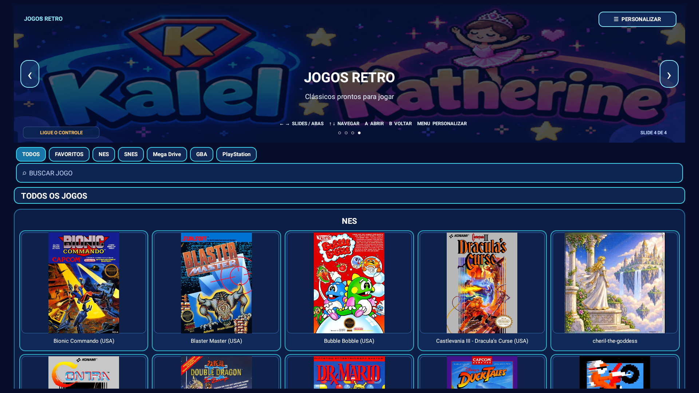

# Games TV Box

Launcher familiar para Fire TV/Android TV que transforma um acervo autorizado em uma biblioteca navegável por controle, com capas, busca, filtros, favoritos e integração com RetroArch.

## TL;DR

O Games TV Box reduz a configuração manual de jogos retro no Fire TV: o Manager Windows conecta por ADB, prepara o catálogo e envia o launcher; o app `Jogos Retro` organiza as plataformas e abre cada jogo no RetroArch.

Com ele você pode:

- navegar por NES, SNES, Mega Drive, GBA e PlayStation;
- buscar jogos, filtrar plataformas e abrir favoritos pelo controle;
- personalizar slides, capas, títulos e legendas sem editar o app;
- preservar ROMs, saves e configurações do RetroArch durante atualizações.
- sincronizar novos jogos diretamente em vários Fire Sticks, com uso offline e progresso visível.

→ [Comece pelo Quick Start](docs/quick-start.md) · [Veja a demonstração](docs/assets/screenshots/launcher-interface.png) · [Leia o manual completo](docs/index.md)

## Demonstração visual

▶ [Assistir ao vídeo interativo](https://github.com/kivervinicius/games-tvbox/raw/refs/heads/main/docs/assets/videos/games-tvbox-interactive-demo.mp4) · [Ver todas as screenshots](docs/assets/screenshots/)

O vídeo mostra a navegação pelo controle, a troca de slides e plataformas, a seleção de um jogo e o retorno ao launcher.

## O que este produto melhora?

| Antes / problema | Com o Games TV Box |
|---|---|
| procurar cada jogo dentro do RetroArch | biblioteca visual agrupada por plataforma |
| configurar ADB manualmente a cada tentativa | Manager com conexão, diagnóstico e instalação |
| capas e slides fixos | personalização local persistente |
| controle sem atalho claro de retorno | atalhos visíveis e retorno ao launcher |
| risco de misturar biblioteca e configuração | ROMs e saves permanecem fora do código público |

## O que está incluído

- `launcher-android/`: fonte do aplicativo Jogos Retro, catálogo de exemplo, temas e capas.
- `manager-windows/`: Manager PowerShell para ADB, catálogo e aparência.
- `scripts/`: build, auditoria e validações repetíveis.
- `examples/`: modelos neutros de catálogo, tema, RetroArch e controle.
- `docs/`: guias de usuário, desenvolvimento, operação, arquitetura e referência.

## Requisitos

- Windows 10/11 para o Manager e o build.
- PowerShell 7, Java 8+ e Android Platform Tools.
- Fire TV/Android TV com depuração ADB habilitada.
- RetroArch e cores compatíveis com a arquitetura do aparelho.

## Documentação por objetivo

- [Índice da documentação](docs/index.md)
- [Quick Start](docs/quick-start.md)
- [Instalação detalhada](docs/installation.md)
- [Funcionalidades](docs/features/index.md)
- [Manual visual](docs/manual/README.md)
- [Configuração](docs/reference/configuration.md)
- [Exemplos de configuração](examples/README.md)
- [Solução de problemas](docs/troubleshooting.md)
- [Arquitetura](docs/architecture/overview.md)
- [Desenvolvimento](docs/development/build.md)

## Desenvolvimento

Execute `pwsh -File launcher-android/tests/project.tests.ps1` e `pwsh -File manager-windows/tests/Test-Manager.ps1`. Antes de enviar alterações, rode `pwsh -File scripts/Verify-PublicRelease.ps1`.

O build Android usa API 28 e aceita um keystore externo por `-KeystorePath` ou pelas variáveis `FIRERETRO_KEYSTORE`, `FIRERETRO_KEY_ALIAS` e `FIRERETRO_KEY_PASSWORD`. Nunca adicione chaves privadas ao Git.

Leia [CONTRIBUTING.md](CONTRIBUTING.md) e [SECURITY.md](SECURITY.md) antes de abrir uma alteração.
