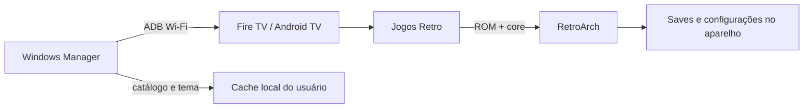

# Arquitetura

## Visão geral

O sistema tem dois aplicativos locais. O Manager prepara e administra; o launcher apresenta a biblioteca e encaminha a abertura para o RetroArch. Não há backend, banco ou autenticação de conta.

## Módulos

| Módulo | Responsabilidade | Evidência |
|---|---|---|
| Launcher Android | UI, foco do controle, catálogo, slides e handoff | `launcher-android/app/src/main/java/com/kiver/fireretro/MainActivity.java` |
| Estado de navegação | normalização de índices e troca de slides | `LauncherState.java`, `ThemeState.java` |
| Manager Windows | ADB, catálogo, cache e aparência | `manager-windows/FireRetroManager.ps1` |
| Build | compilar, alinhar e assinar o APK | `launcher-android/scripts/Build-FireRetro.ps1` |
| Auditoria | layout público, testes e arquivos proibidos | `scripts/Verify-PublicRelease.ps1` |

## Fluxo de dados

`games.json` embutido fornece exemplos; o tema externo em `/sdcard/Android/data/com.kiver.fireretro/files/theme` substitui o tema padrão quando válido. O launcher envia `ROM`, `LIBRETRO` e `CONFIGFILE` ao `RetroActivityFuture` do RetroArch.

## Persistência e cache

O launcher guarda apenas último jogo e último slide nas preferências Android. O Manager mantém configurações, catálogo e imagens no cache `%LOCALAPPDATA%\FireRetroManager`. ROMs e saves ficam fora do repositório.

## Segurança

ADB e Bluetooth dependem de autorização no sistema. O projeto não coleta dados, não expõe servidor e não contém credenciais. Consulte [SECURITY.md](../../SECURITY.md).

## Deployment

O deployment atual é sideload por ADB. A documentação oficial da Amazon descreve a conexão e instalação por ADB em [Install and Run Your App](https://developer.amazon.com/docs/fire-tv/installing-and-running-your-app.html).
