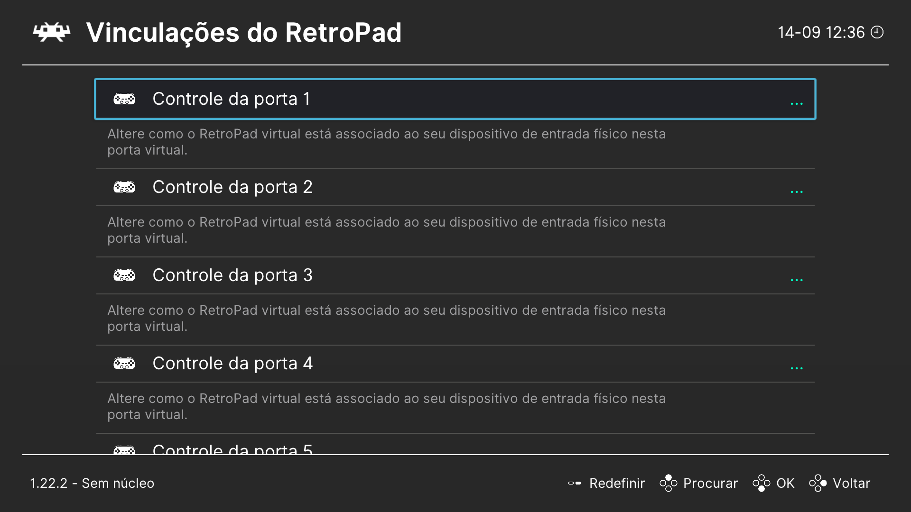
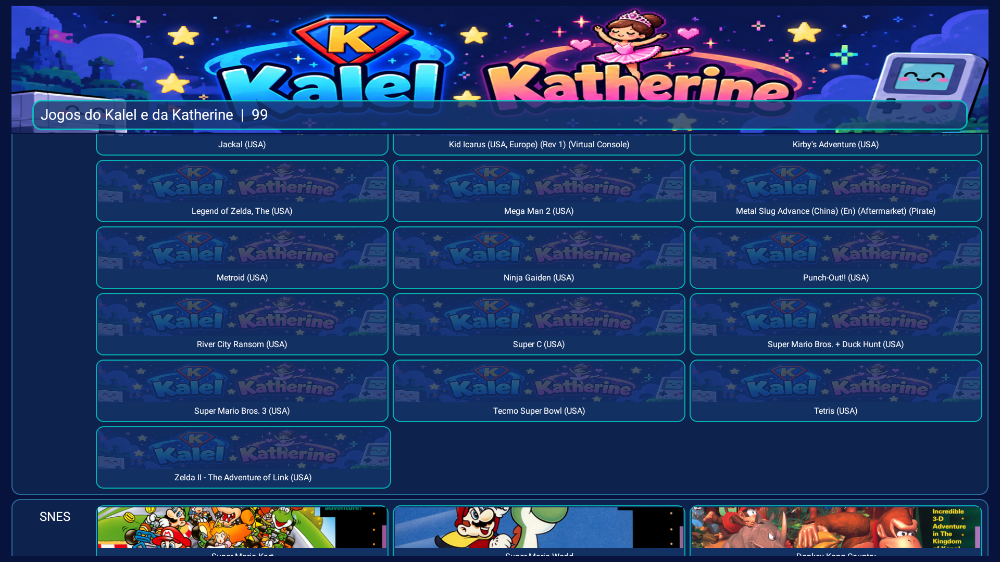
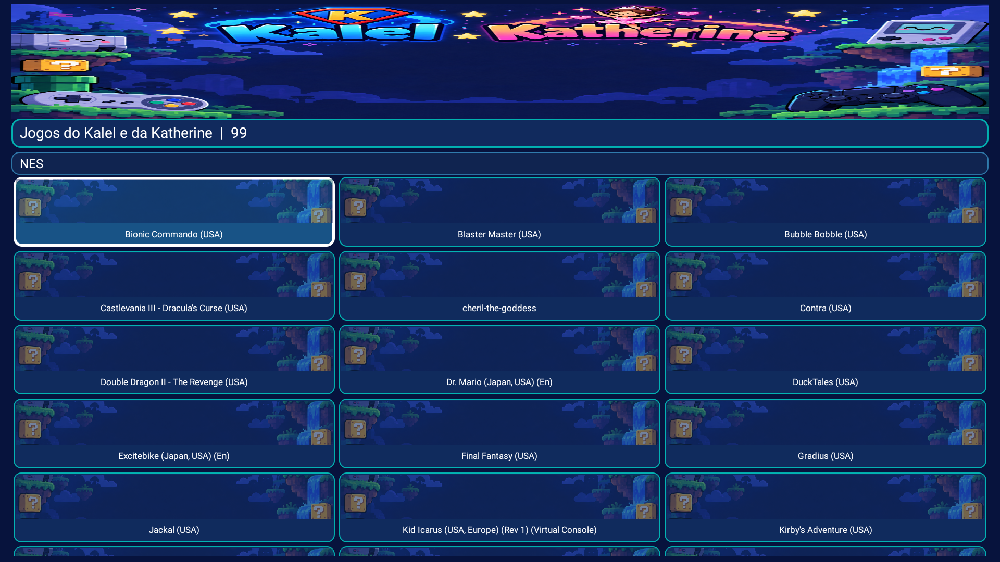

# Manual do Games TV Box

Este manual orienta a instalação e o uso do launcher no Fire TV Stick e do Manager no Windows.

## Antes de começar

Você precisa de um Fire TV/Android TV compatível, uma rede local compartilhada com o computador, Android Platform Tools e o RetroArch adequado à arquitetura do aparelho. Use somente ROMs que você tem direito de utilizar.

## Instalação rápida

1. Extraia o projeto e abra `manager-windows/Start-FireRetroManager.cmd`.
2. No Manager, informe o endereço do Fire TV e conecte por ADB.
3. Na primeira conexão, aceite a autorização exibida na televisão.
4. Escolha a pasta local que contém seu catálogo de ROMs.
5. Instale ou atualize o launcher e abra `Jogos Retro` no Fire TV.
6. Conecte o controle Bluetooth nas configurações do Fire TV e faça o mapeamento no RetroArch.

## Navegação pelo controle

Use cima e baixo para navegar entre áreas, esquerda e direita para trocar slide ou aba, A para abrir, B para voltar e Menu para ver a personalização. A busca pode ser selecionada como qualquer outro campo.

## Personalização

No Manager, abra `Slides e aparência` para escolher imagens, títulos e legendas. Salve no Fire Stick para enviar o tema. O launcher usa o tema padrão quando nenhum tema personalizado foi enviado.

## Jogos e plataformas

O catálogo separa NES, SNES, Mega Drive, GBA e PlayStation. Adicione somente arquivos compatíveis com o core correspondente e mantenha seus saves no armazenamento do RetroArch.

## Saída de um jogo

Use o atalho configurado no RetroArch para abrir o menu e escolher `Fechar conteúdo` ou `Sair`. Se o controle travar, pressione Home no controle do Fire TV, reabra `Jogos Retro` e remapeie o perfil antes de iniciar novamente.

## Atualização e preservação

Atualizar o launcher substitui somente o aplicativo. Não apague as pastas de ROMs, saves ou configurações do RetroArch. O Manager mantém suas preferências do Windows no cache local.

Consulte [solução de problemas](troubleshooting.md) e o [guia de vídeo](VIDEO.md) quando algo não funcionar.
