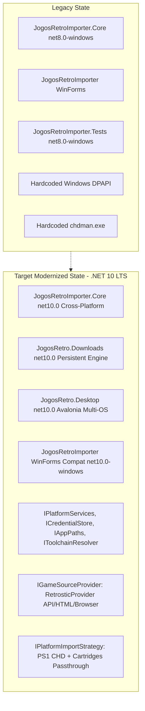

# Baseline Audit: Importer Architecture & Dependencies

## 1. Executive Summary

This document establishes the technical baseline of the existing game import pipeline in `games-tvbox` (`importer-windows/`), documenting its current capabilities, architectural boundaries, platform-specific locks, and gaps that must be addressed to support cross-platform execution (Linux + Windows), the Retrostic catalog/download provider, and future reuse in Android Gamer.

---

## 2. Current Inventory & Technology Stack

| Component | Current Path | Target Framework | Core Dependencies | Platform Lock |
|---|---|---|---|---|
| **JogosRetroImporter.Core** | `importer-windows/src/JogosRetroImporter.Core` | `net8.0-windows` | `SharpCompress` (0.50.4), `System.Security.Cryptography.ProtectedData` (8.0.0) | **Windows Only** (DPAPI, `.exe` toolchain, `LocalApplicationData`) |
| **JogosRetroImporter (GUI)** | `importer-windows/src/JogosRetroImporter` | `net8.0-windows` | Windows Forms (`UseWindowsForms=true`) | **Windows Only** (Win32 GDI/User32) |
| **JogosRetroImporter.Tests** | `importer-windows/tests/JogosRetroImporter.Tests` | `net8.0-windows` | None (procedural console runner) | **Windows Only** (inherits core `net8.0-windows`) |
| **Toolchain** | `importer-windows/toolchain.lock.json` | N/A | `chdman.exe` (MAME 0.289) | **Windows x64 Only** |
| **Installer** | `importer-windows/installer/JogosRetroImporter.iss` | N/A | Inno Setup | **Windows Only** |

---

## 3. Detailed Audit of Windows Locks & Limitations

### 3.1. Framework Target Lock (`net8.0-windows`)
- Both the core library and the test harness target `net8.0-windows`.
- Compiling or executing on Linux fails immediately under the standard .NET runtime due to the Windows TFM.

### 3.2. Credential Storage Lock (DPAPI)
- `SecureTokenStore.cs` directly invokes `ProtectedData.Protect` and `ProtectedData.Unprotect` with `DataProtectionScope.CurrentUser`.
- On Linux, this API throws `PlatformNotSupportedException`.
- **Target Resolution**: Introduce an `ICredentialStore` abstraction with implementations:
  - Windows: DPAPI provider (`WindowsDpapiCredentialStore`).
  - Linux: FreeDesktop Secret Service / Keyring / encrypted fallback (`LinuxSecretStore`).
  - Portable fallback: AES-256-GCM encrypted file with user-derived key.

### 3.3. Hardcoded File System Paths
- Configuration, tools, and cache paths default to `Environment.GetFolderPath(Environment.SpecialFolder.LocalApplicationData)`.
- On Linux, this maps to `~/.local/share` indiscriminately, ignoring the XDG Base Directory specification:
  - Config: `$XDG_CONFIG_HOME` (default `~/.config/jogos-retro`)
  - Cache/Staging: `$XDG_CACHE_HOME` (default `~/.cache/jogos-retro`)
  - Data: `$XDG_DATA_HOME` (default `~/.local/share/jogos-retro`)
- **Target Resolution**: Implement `IAppPaths` resolving OS-native paths conforming to XDG on Linux/Unix and LocalAppData on Windows.

### 3.4. Binary Toolchain Lock (`chdman.exe`)
- `ToolchainManager.cs` hardcodes `chdman.exe`.
- It cannot locate or execute Linux native binaries (`chdman` without `.exe`), nor does it support system-installed package managers (`which chdman` / `/usr/bin/chdman`).
- **Target Resolution**: Implement `IToolchainResolver` supporting:
  - OS-specific binary names (`chdman.exe` on Windows, `chdman` on Linux).
  - Runtime architecture resolution (`linux-x64`, `linux-arm64`, `win-x64`).
  - Lookup order: App-local bundled tool -> Configured cache -> System `PATH`.

### 3.5. Single-Platform Import Pipeline (PlayStation Only)
- `ImportPipeline.cs` only exposes `PreparePlayStationAsync`.
- Non-disc cartridges (NES `.nes`, SNES `.smc`/`.sfc`, Mega Drive `.md`/`.gen`, GBA `.gba`) are detected in `PlatformDetector.cs` but rejected by the pipeline.
- Archives (`.zip`, `.7z`) are extracted without platform-specific dispatch or validation rules.
- **Target Resolution**: Implement a modular `IPlatformImportStrategy` engine:
  - `PlayStationImportStrategy`: CUE/BIN/ISO extraction -> CueSheet validation -> CHD conversion via `chdman` -> Libretro metadata.
  - `CartridgeImportStrategy` (NES, SNES, Mega Drive, GBA): Archive extraction -> Header / size validation -> Direct passthrough (clean canonical ROM) -> Metadata matching.

### 3.6. Lack of Remote Acquisition & Download Management
- The current importer only accepts local file paths.
- It lacks any abstraction for searching remote game databases, querying metadata, resolving download URLs, or managing large binary transfers.
- No support for HTTP Range headers, chunked resumption, progress reporting, or retry with backoff.
- **Target Resolution**: Architect `IGameSourceProvider`, `AcquisitionResolver`, and a persistent `DownloadManager`.

### 3.7. Monolithic Single-File Cloud Publication
- `CloudPublisherClient.cs` exposes `PublishFileAsync`, which reserves an R2 upload, streams the file, finalizes it, and publishes the catalog item in sequence.
- Publishing multi-asset items (ROM + Cover + Save State template) is not coordinated atomically, risking dangling cloud artifacts.
- **Target Resolution**: Support batch/atomic publication (`PublishGameAsync`) publishing assets and catalog metadata within a single verified transaction.

### 3.8. Windows Forms UI Lock
- `JogosRetroImporter` relies entirely on Windows Forms (`Form1.cs`), which does not run on Linux.
- **Target Resolution**: Create `JogosRetro.Desktop` using Avalonia UI (`net10.0`), running natively across Windows and Linux (X11 / Wayland), while preserving the existing WinForms app during migration.

---

## 4. Target Modernization Path

This audit establishes the baseline specifications for subsequent ADRs and implementation stages.
