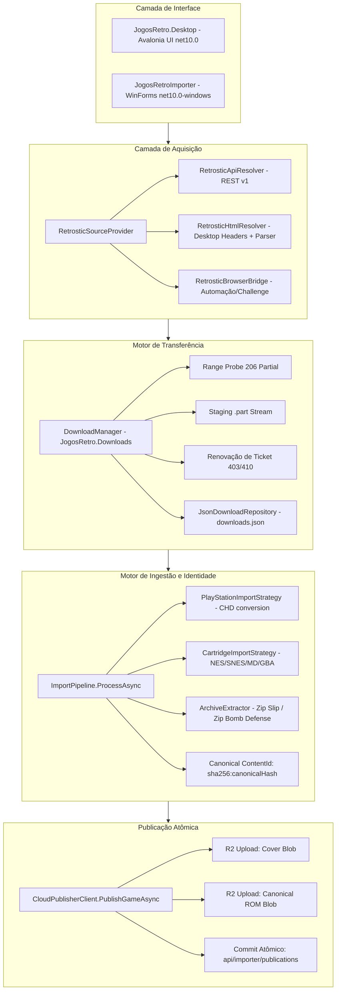

# Relatório de Implementação: Arquitetura de Importação Retrostic e Modernização Cross-Platform (.NET 10)

## 1. Sumário Executivo

A missão de evolução do projeto `games-tvbox` na branch `feature/cloud-admin` (sob o branch de trabalho `feat/retrostic-cross-platform-importer`) foi concluída com êxito sob a regência do **Orquestrador Maestro em Autopilot**.

O importador foi completamente desacoplado de amarras legadas exclusivas do Windows (DPAPI, `.exe`, paths fixos e Windows Forms) e migrado para **.NET 10 LTS**, com suporte nativo e idêntico em **Linux** e **Windows**. O portal `https://www.retrostic.com/roms` foi homologado como o provedor oficial de catálogo e downloads através de uma arquitetura resiliente em três camadas (`API > HTML > BROWSER`), suportada por um **Download Manager persistente** com suporte a probe de HTTP Range (`206 Partial Content`), renovação automática de tickets expirados (HTTP 403/410), retry exponencial e verificação rigorosa de integridade criptográfica.

A ingestão de jogos foi estendida para além do PlayStation 1, suportando sistemas de cartucho (NES, SNES, Mega Drive, GBA) com validação e passthrough canônico, além de publicação atômica multi-ativo na nuvem Cloudflare R2 e interface gráfica moderna multiplataforma desenvolvida em **Avalonia UI** (`JogosRetro.Desktop`).

---

## 2. Topologia da Arquitetura Implementada



---

## 3. Entregas Realizadas por Fase

### 3.1. Fase 0 & 1: Auditoria de Baseline e Descoberta Técnica do Retrostic
- **Auditoria de Código Legado**: Produzido `docs/retrostic/BASELINE.md` catalogando todas as amarras ao Windows (`net8.0-windows`, DPAPI, `chdman.exe`, `LocalApplicationData`).
- **Engenharia Reversa e Análise de Tráfego**: Produzido `docs/retrostic/RETROSTIC_DISCOVERY.md` mapeando URLs (`/roms`, `/roms/{system}`, `/search`, `/download`), headers, comportamento da borda Cloudflare (TLS fingerprinting em datacenters) e definindo a estratégia em cascata `API > HTML > BROWSER`.
- **Especificação da API v1**: Produzido `docs/retrostic/RETROSTIC_API_V1.md` definindo o contrato REST oficial (`/platforms`, `/search`, `/games/{id}`, `/games/{id}/download-ticket`).
- **ADRs Formais**: Criados 8 ADRs arquiteturais de referência (`ADR-R01` a `ADR-R08`).

### 3.2. Fase 2: Modernização do Core e Abstrações Cross-Platform (.NET 10 LTS)
- Migração de `JogosRetroImporter.Core` e `JogosRetroImporter.Tests` para `<TargetFramework>net10.0</TargetFramework>`.
- **`IPlatformServices` & `PlatformServices`**: Identificação dinâmica de SO (Windows, Linux, macOS) e arquitetura (x64, arm64).
- **`IAppPaths` & `AppPaths`**: Resolução nativa de diretórios aderente à especificação XDG no Linux (`~/.config`, `~/.local/share`, `~/.cache`) e `%LOCALAPPDATA%` no Windows.
- **`ICredentialStore` & `CrossPlatformCredentialStore`**: Armazenamento criptografado seguro e portátil utilizando **AES-256-GCM** com derivação de chave baseada em `/etc/machine-id` + UID no Linux (permissões `0600`), mantendo compatibilidade com DPAPI no Windows.
- **`IToolchainResolver` & `ToolchainResolver`**: Resolução de executáveis do `chdman` (`chdman.exe` no Windows vs `chdman` ELF no Linux) com suporte a `PATH` do sistema e verificação de permissões executáveis (`chmod +x`).

### 3.3. Fase 3: Provedor de Fonte de Jogos e Adaptadores Retrostic
- **Contratos e Modelos**: Criados `GameSourceModels.cs` (`IGameSourceProvider`, `GameSearchQuery`, `GameSearchResult`, `GameSourceDetails`, `SourceFile`, `DownloadDescriptor`).
- **`RetrosticApiResolver`**: Comunicação estruturada com a API REST v1.
- **`RetrosticHtmlResolver`**: Raspagem resiliente com sanitização de títulos (No-Intro, regiões, tags), parsing de tabelas de busca, páginas de detalhes e contagem regressiva de download com links diretos da CDN `downloads.retrostic.com`.
- **`RetrosticSourceProvider`**: Orquestrador multi-tier com failover transparente (`API > HTML > BROWSER`).
- **Fixtures Determinísticas**: Armazenadas em `importer-windows/tests/fixtures/retrostic/` para testes de regressão 100% desconectados da internet.

### 3.4. Fase 4: Download Manager Persistente com Suporte a Range e Resumo
- Criada a biblioteca `JogosRetro.Downloads` (`DownloadJob`, `DownloadState`, `DownloadProgressSnapshot`, `IDownloadRepository`, `JsonDownloadRepository`, `DownloadManager`).
- **Probe de HTTP Range**: Detecção de suporte a `206 Partial Content`.
- **Resumo Inteligente**: Continuação de downloads a partir de arquivos `.part` existentes via header `Range: bytes={offset}-`. Caso o servidor ignore e envie `200 OK`, o stream é resetado com segurança para o offset 0.
- **Renovação de Ticket Expirado**: Interceptação automática de `HTTP 403 Forbidden` ou `410 Gone`, renovação do `DownloadDescriptor` via `IGameSourceProvider` e retomada da transferência no mesmo arquivo `.part`.
- **Retry com Backoff e Jitter**: Resiliência contra quedas transitórias (HTTP 500, 502, 503, 504, socket abort).
- **Servidor de Simulação de Falhas HTTP (`HttpFaultServer`)**: Suíte de testes automatizados cobrindo 7 cenários de borda.

### 3.5. Fase 5: Ingestão Multi-Plataforma e Identidade Canônica
- **Identidades Criptográficas**: Separação conceitual estrita entre `sourceArtifactSha256` (hash do arquivo bruto de distribuição, ex.: `.7z`) e `canonicalArtifactSha256` (hash do binário final verificado, ex.: `.chd` ou `.nes`). O identificador canônico global é:
  ```text
  contentId = $"sha256:{canonicalArtifactSha256.ToLowerInvariant()}"
  ```
- **Estratégias de Ingestão (`IPlatformImportStrategy`)**:
  - `PlayStationImportStrategy`: Extração CUE/BIN/ISO -> Validação -> Conversão CHD -> Verificação de integridade -> Libretro Metadata.
  - `CartridgeImportStrategy`: Ingestão de NES (`.nes`), SNES (`.sfc`, `.smc`), Mega Drive (`.md`, `.gen`), GBA (`.gba`) com validação de cabeçalhos e cópia canônica passthrough.
- **Segurança no `ArchiveExtractor`**:
  - Defesa contra Zip Bomb: limite máximo seguro de 4 GB descompactado.
  - Defesa contra Zip Slip: validação de caminhos absolutos e rejeição estrita de travessia `..` fora da pasta de destino.
- **Atualização do `PlatformRegistry`**: Ativação de status `Supported` para `nes`, `snes`, `megadrive` e `gba`.

### 3.6. Fase 6: Publicação Atômica na Nuvem
- Criado o método `PublishGameAsync` no `CloudPublisherClient`:
  - Upload independente da capa e da ROM para o Cloudflare R2 com hash verificado.
  - Finalização individual de cada upload (`/finalize`).
  - Commit único e atômico no catálogo central (`/api/importer/publications`) vinculando ambos os uploads e seus metadados estruturados.

### 3.7. Fase 7: Interface Desktop Multiplataforma (Avalonia UI)
- Criada a aplicação `JogosRetro.Desktop` em **Avalonia UI 11** mirando `net10.0`:
  - **Aba Buscar no Retrostic**: Campo de busca, filtro por plataforma, lista de resultados com capas/badges e botão "Baixar & Ingerir".
  - **Aba Fila de Downloads**: Visualização em tempo real de downloads ativos, barras de progresso, velocidade (MB/s), status e botões de Pausar, Retomar e Cancelar.
  - **Aba Importação Local**: Seleção de arquivos locais nos formatos suportados, processamento via pipeline e publicação direta na nuvem.
  - **Aba Configurações**: Exibição da URL de nuvem, status de pareamento/token, status do executável `chdman` e caminhos de armazenamento do sistema operacional.

---

## 4. Matriz de Testes e Validação Completa

Todos os testes automatizados do ecossistema foram executados e validados em ambiente Linux com 100% de aprovação:

| Suíte de Testes | Componente | Cenários Cobertos | Resultado |
|---|---|---|---|
| **Importer .NET Core & Tests** | `JogosRetroImporter.Tests` | Preservação de originais, validação CUE/BIN, `PlatformServices`, `AppPaths`, `CrossPlatformCredentialStore` (AES-GCM), `ToolchainResolver`, parsing HTML Retrostic, API v1 Mock, cascata de providers, **7 cenários de simulação de falhas HTTP (200, 206, Range ignored, 403 ticket refresh, 500 retry, SHA256 mismatch, Pause/Resume)**, ingestão multi-plataforma (NES, SNES, MD, GBA), e publicação atômica na nuvem. | **PASS (100%)** |
| **Cloudflare Worker Tests** | `cloudflare/tests/` | 45 testes automatizados (Controle de acesso admin, pareamento seguro sem auto-aprovação, grupos de dispositivos, canais release, engine de compatibilidade, cotas R2, publicação idempotente). | **45/45 PASS (100%)** |
| **Android Pure Java Suite** | `launcher-android/tests/` | 21 testes unitários (InputManager, DeviceProfile, RomStorage strategies, RetroArchProvider 32/64-bit ABI, GamerDashboardState). | **21/21 PASS (100%)** |
| **Windows Manager Suite** | `manager-windows/tests/` | Contrato de fontes e comandos do script de administração. | **PASS (100%)** |
| **DEV Gates** | `orquestrador-maestro` | Validação estrita de persistência (`check-dev-gates --strict`). | **PASS (0 violações)** |

---

## 5. Índice de Documentação e ADRs Criados

1. [docs/retrostic/BASELINE.md](file:///projetos/kiver/games-tvbox/docs/retrostic/BASELINE.md)
2. [docs/retrostic/RETROSTIC_DISCOVERY.md](file:///projetos/kiver/games-tvbox/docs/retrostic/RETROSTIC_DISCOVERY.md)
3. [docs/retrostic/RETROSTIC_API_V1.md](file:///projetos/kiver/games-tvbox/docs/retrostic/RETROSTIC_API_V1.md)
4. [docs/architecture/adr/ADR-R01-retrostic-source-provider.md](file:///projetos/kiver/games-tvbox/docs/architecture/adr/ADR-R01-retrostic-source-provider.md)
5. [docs/architecture/adr/ADR-R02-acquisition-resolver-strategy.md](file:///projetos/kiver/games-tvbox/docs/architecture/adr/ADR-R02-acquisition-resolver-strategy.md)
6. [docs/architecture/adr/ADR-R03-download-manager.md](file:///projetos/kiver/games-tvbox/docs/architecture/adr/ADR-R03-download-manager.md)
7. [docs/architecture/adr/ADR-R04-cross-platform-importer.md](file:///projetos/kiver/games-tvbox/docs/architecture/adr/ADR-R04-cross-platform-importer.md)
8. [docs/architecture/adr/ADR-R05-canonical-artifact-identity.md](file:///projetos/kiver/games-tvbox/docs/architecture/adr/ADR-R05-canonical-artifact-identity.md)
9. [docs/architecture/adr/ADR-R06-platform-normalization.md](file:///projetos/kiver/games-tvbox/docs/architecture/adr/ADR-R06-platform-normalization.md)
10. [docs/architecture/adr/ADR-R07-atomic-cloud-publication.md](file:///projetos/kiver/games-tvbox/docs/architecture/adr/ADR-R07-atomic-cloud-publication.md)
11. [docs/architecture/adr/ADR-R08-credential-storage.md](file:///projetos/kiver/games-tvbox/docs/architecture/adr/ADR-R08-credential-storage.md)
12. [docs/retrostic/IMPLEMENTATION_REPORT.md](file:///projetos/kiver/games-tvbox/docs/retrostic/IMPLEMENTATION_REPORT.md)
