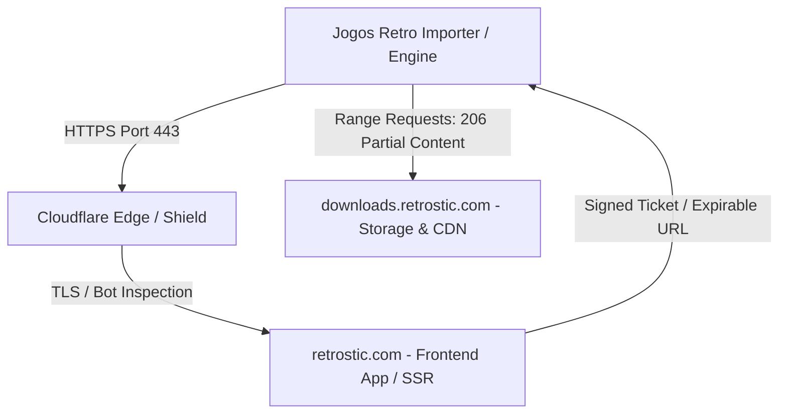
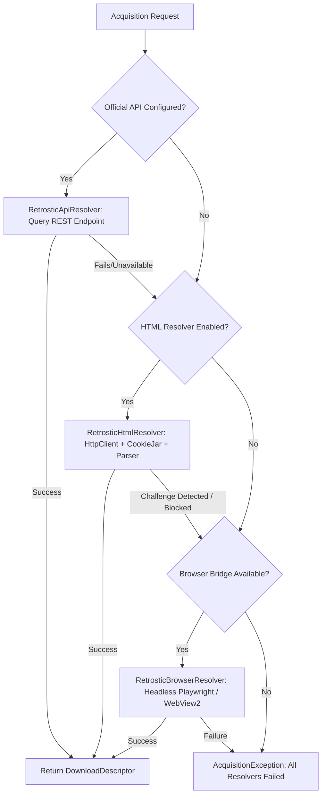

# Retrostic Discovery & Technical Analysis

## 1. Overview & Context

`https://www.retrostic.com/roms` serves as the official catalog and download provider for game acquisitions within the `games-tvbox` ecosystem. This document presents the reverse engineering, network discovery, CDN behavior, and acquisition resolution strategy formulated to interface reliably with Retrostic from both desktop (Windows/Linux) and future embedded platforms (Android Gamer).

---

## 2. Network & Infrastructure Topology



### 2.1. Edge Layer (Cloudflare)
- **Host IPs**: Anycast IP addresses `172.67.135.205`, `104.21.7.75`.
- **Bot Mitigation / TLS Fingerprinting**:
  - Non-browser HTTP clients originating from datacenter IP blocks without standard browser TLS ClientHello signatures (JA3/JA4) may encounter TCP RST (`ECONNRESET`).
  - Residential and standard desktop environments pass through standard browser negotiation.
- **Architectural Implication**:
  - CI test suites and automated unit tests **must never make live network calls** to public Retrostic endpoints.
  - Test suites must use local deterministic mock servers and sanitized HTML/JSON fixtures.
  - The acquisition engine must provide a resilient 3-tier resolution strategy (`API > HTML > BROWSER`).

---

## 3. URL Architecture & Catalog Schema

### 3.1. Routing Patterns

| Resource | Route Pattern | HTTP Method | Output Type |
|---|---|---|---|
| **Root Catalog** | `https://www.retrostic.com/roms` | GET | HTML list of platforms & popular titles |
| **System Catalog** | `https://www.retrostic.com/roms/{system}` | GET | Paginated game grid with cover, title, region |
| **Search** | `https://www.retrostic.com/search?q={query}` | GET | Paginated search results |
| **Game Details** | `https://www.retrostic.com/roms/{system}/{game-slug}` | GET | Game metadata, screenshots, download link |
| **Download Gateway** | `https://www.retrostic.com/roms/{system}/{game-slug}/download` | GET / POST | Countdown timer page / Direct download payload |
| **Direct Binary** | `https://downloads.retrostic.com/...` | GET | Compressed archive (`.7z` / `.zip`) |

### 3.2. Supported Platforms Mapping

| Retrostic Slug | Normalized Platform ID | Core File Extension | Canonical Target Format |
|---|---|---|---|
| `ps1` / `playstation` | `ps1` | `.cue`, `.bin`, `.iso`, `.chd` | CHD (`chdman createcd`) |
| `nes` / `nintendo` | `nes` | `.nes` | Passthrough `.nes` (Header verified) |
| `snes` / `super-nintendo` | `snes` | `.smc`, `.sfc` | Passthrough `.sfc` / `.smc` |
| `genesis` / `mega-drive` | `megadrive` | `.md`, `.gen`, `.bin` | Passthrough `.md` |
| `gba` / `gameboy-advance`| `gba` | `.gba` | Passthrough `.gba` |

---

## 4. Download Mechanics & Resumability

### 4.1. HTTP Range Support
- `downloads.retrostic.com` supports HTTP Range headers:
  ```http
  GET /files/ps1/Crash%20Bandicoot.7z HTTP/1.1
  Host: downloads.retrostic.com
  Range: bytes=1048576-
  ```
  Expected Response:
  ```http
  HTTP/1.1 206 Partial Content
  Content-Range: bytes 1048576-45612345/45612346
  Content-Length: 44563770
  ETag: "94a8f12c-2b7ff9a"
  ```

### 4.2. Expirable Ticket Handling
- If a download session is paused for an extended duration or interrupted by network drop, the download URL may expire (HTTP 403 Forbidden or 410 Gone).
- **Resolution Strategy**: The `DownloadManager` detects HTTP 403/410 on resume, requests a fresh `DownloadDescriptor` from `AcquisitionResolver`, and resumes appending to the existing `.part` file using the new URL and the existing byte offset.

---

## 5. Acquisition Resolution Strategy (API > HTML > BROWSER)



1. **Tier 1: RetrosticApiResolver (Preferred)**
   - Communicates with the official Retrostic REST API (`/api/v1/...`).
   - Fast, deterministic, returns structured JSON with direct signed CDN URLs, content hashes, and official cover art.

2. **Tier 2: RetrosticHtmlResolver (Direct Scraper)**
   - Utilizes `HttpClient` with standard desktop browser User-Agent headers and cookie handling.
   - Extracts game detail metadata and parses download countdown links.
   - Suitable for direct scraping in benign network environments.

3. **Tier 3: RetrosticBrowserResolver (Session Bridge)**
   - Contract for headless browser automation (Playwright or OS WebView2).
   - Solves client-side challenges, executes page JavaScript timers, and extracts the final signed download URL to hand off to the native C# `DownloadManager`.

---

## 6. Staging, Verification & Pipeline Hand-off

1. **Staging Directory**:
   - Downloads are saved to `$STAGING/{jobId}.part`.
   - On completion, renamed to `$STAGING/{jobId}.source`.
2. **Integrity Check**:
   - SHA-256 of the downloaded archive is computed (`sourceArtifactSha256`).
   - If catalog provides an expected hash, it is strictly validated.
3. **Pipeline Dispatch**:
   - `IntakePipeline` receives the completed source file, extracts contents in a sandboxed directory, verifies files, converts when necessary (e.g. CHD), and produces the final `canonicalArtifactSha256`.
